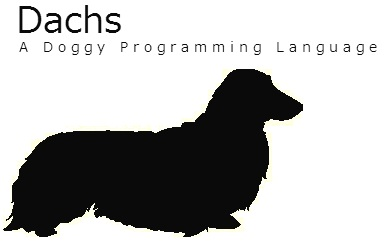

**Now new version is being developed in ['next' directory](./next). It will replace current C++ implementation.**

Dachs is a general-purpose programming language designed to be enjoyable, statically-typed and dog-friendly. Dachs is intended to be used for efficient applications and tools development, not for system programming.

Goals :dog2:
- Light to write (inspired by Ruby)
- Strongly and statically typed
- Native code efficiency
- OOP
- Immutability-aware
- Familiar with functional features
- Dog-friendly

<pre>
<i># If 'var' is specified, the argument is copied and passed by value</i>
<i># then mutable.  Otherwise, the argument is passed by reference then</i>
<i># immutable. Variable definition has the same rule as this.</i>
<i># Type of arguments and returned value are deduced automatically.</i>

<i># If you want to specify the type of argument, you can use ':'.</i>
<i># e.g.</i>
<i>#   func step_to(var first : float, last : float, block) : ()</i>

<b>func</b> step_to(<b>var</b> first, last, block)
    <b>for</b> first &lt;= last
        block(first)
        first += 1
    <b>end</b>
<b>end</b>

<i># UFCS is implemented.</i>
<i># '1.step_to n' is equivalent to 'step_to(1, n)'</i>

<i># Dachs has a block inspired from Ruby.</i>
<i># do-end block is passed to the last argument of callee as lambda object.</i>
<i># Here, 'block' variable is captured into do-end block.</i>

<b>func</b> fizzbuzz(n, block)
    1.step_to n <b>do</b> |i|
        <b>case</b>
        <b>when</b> i % 15 == 0
            block("fizzbuzz")
        <b>when</b> i %  3 == 0
            block("fizz")
        <b>when</b> i %  5 == 0
            block("buzz")
        <b>else</b>
            block(i)
        <b>end</b>
    <b>end</b>
<b>end</b>

<b>func</b> main
    fizzbuzz 100 <b>do</b> |i|
        println(i)
    <b>end</b>
<b>end</b>

<i># Array and tuple are available as container.</i>
<i># (dictionary will come.)</i>
</pre>

<!--
# If 'var' is specified, the argument is copied and passed by value
# then mutable.  Otherwise, the argument is passed by reference then
# immutable. Variable definition has the same rule as this.
# Type of arguments and returned value are deduced automatically.

# If you want to specify the type of argument, you can use ':'.
# e.g.</i>
#   func step_to(var first : float, last : float, block) : ()

func step_to(var first, last, block)
    for first <= last
        block(first)
        first += 1
    end
end

# UFCS is implemented.
# '1.step_to n' is equivalent to 'step_to(1, n)'

# Dachs has a block inspired from Ruby.
# do-end block is passed to the last argument of callee as lambda object.
# Here, 'block' variable is captured into do-end block.

func fizzbuzz(n, block)
    1.step_to n do |i|
        case
        when i % 15 == 0
            block("fizzbuzz")
        when i %  3 == 0
            block("fizz")
        when i %  5 == 0
            block("buzz")
        else
            block(i)
        end
    end
end

func main
    fizzbuzz 100 do |i|
        println(i)
    end
end

# Array and tuple are available as container.
# (dictionary will come.)
-->

## Progress Report

- [x] Basic literals
- [x] Basic expressions
- [x] Basic statements
- [x] Basic strong type check
- [x] Functions
- [x] Operator functions
- [x] Overload resolution
- [x] Simple return type and variable type deduction
- [ ] Type inference
- [x] UFCS
- [x] Class
- [x] Lambda
- [x] Block
- [ ] Variadic arguments
- [ ] Module
- [x] GC
- [x] Tests
- [x] CMakeLists.txt
- [x] Travis-CI
- [ ] Option parser
- [ ] Allocator customization
- [ ] Introduce [OvenToBoost](https://github.com/faithandbrave/OvenToBoost)

This software is disributed under [The MIT License](http://opensource.org/licenses/MIT) if not specified in a source file.

    Copyright (c) 2014-2015 rhysd

This software uses [Boost C++ Libraries](http://www.boost.org/), which is licensed by [The Boost License](http://www.boost.org/users/license.html).

> Boost Software License - Version 1.0 - August 17th, 2003

This software uses [LLVM](http://llvm.org/), which is licensed by [University of Illinois/NCSA Open Source License](http://opensource.org/licenses/UoI-NCSA.php).

> Copyright (c) 2003-2014 University of Illinois at Urbana-Champaign
